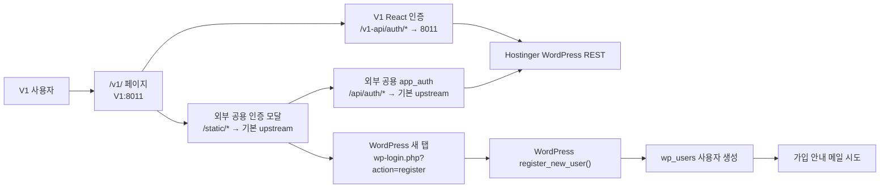

# V1 회원가입·로그인·메일 인증 고도화 조사 보고서

- 작성일: 2026-07-27
- 대상: `https://app.mystorymaker.net/v1/`
- 조사 방식: Dell 소스·컨테이너·Nginx Proxy Manager·Hostinger WordPress 플러그인·공개 브라우저 흐름 읽기 전용 점검
- 변경 여부: 없음. 회원 생성 POST, 메일 발송, DB 변경, 배포를 수행하지 않음

## 1. 결론 요약

현재 문제는 세 가지가 겹친 결과다.

1. WordPress 회원가입은 사용자를 먼저 만든 뒤 메일을 보낸다. 따라서 메일 발송 실패나 실제 미수신이 WordPress 사용자 생성 실패로 되돌아가지 않는다.
2. Hostinger의 StoryMaker 인증 플러그인은 모든 WordPress 사용자에게 `email_verified=true`를 고정 반환하고, 로그인 시 실제 인증 완료 여부를 검사하지 않는다.
3. V1 화면이 V1 전용 인증 자산이 아니라 기본 upstream의 공용 `/static/auth_modal_unified.js`와 `/static/app_auth.js`를 로드한다. V1 React 번들은 `/v1-api`를 쓰지만 공용 모달은 `/api`를 써서, V1 요청 일부가 V1 백엔드 밖으로 이탈한다.

따라서 모달 CSS만 정리하거나 메일 발송 성공 여부만 확인하는 수정으로는 해결되지 않는다. 최우선 과제는 **V1 인증 경로의 소유권을 V1 안으로 단일화**하고, 그 다음 **메일 인증 완료 전에는 `wp_users`에 사용자를 만들지 않는 2단계 가입 구조**로 전환하는 것이다. 본 보고서의 개선·수정·데이터 정리 대상은 V1과 WordPress 가입 연동으로 한정한다.

## 2. 현재 구조

이 구조에서는 V1 화면의 로그인 주체, 쿠키, 로컬 사용자 ID, 회원가입 UI가 한 경로로 묶여 있지 않다.

## 3. 확인된 근거

### 3.1 V1 자체 회원가입 API는 차단되어 있다

- 파일: `/home/bourne/StoryMaker_1/storymaker-web/backend/app/api/auth.py`
- `559~567`행의 `POST /auth/join`은 항상 HTTP 400을 반환하며 WordPress 가입 페이지 사용을 요구한다.
- 즉 V1 DB에 직접 가입하는 흐름은 없다.

### 3.2 V1 로그인은 WordPress 성공 후 로컬 사용자를 만든다

- 같은 파일 `388~477`행
- `POST /auth/login`은 Hostinger의 `/wp-json/storymaker/v1/login`을 호출한다.
- WordPress 인증 성공 후 `wordpress_user_id`로 V1 로컬 사용자를 찾고, 없으면 `users` 행을 생성한다.
- WordPress 응답의 `email_verified` 또는 가입 상태를 검사하지 않는다.

### 3.3 V1 로컬 사용자 모델에는 이메일 인증 상태가 없다

- 파일: `/home/bourne/StoryMaker_1/storymaker-web/backend/app/db/models.py`
- `User` 모델 `41~61`행
- `email`, `email_verified`, `registration_status`, `verified_at`, `verification_expires_at` 컬럼이 없다.
- V1 로컬 DB는 인증 원장이 아니라 WordPress 로그인 성공 후 만들어지는 작업용 그림자 프로필로 보는 것이 안전하다.

### 3.4 Hostinger 플러그인은 사용자 생성과 메일 성공을 분리하지 않는다

- 파일: `wp-content/plugins/storymaker-auth/storymaker-auth.php`
- 공개 REST `POST /wp-json/storymaker/v1/register`는 `register_new_user($username, $email)`을 호출한다.
- `register_new_user()`이 오류가 아니면 곧바로 `ok=true`, `user_id`, 이메일을 반환한다.
- 플러그인은 메일이 실제로 전달됐는지 확인하지 않으며, `pending` 상태도 저장하지 않는다.
- 사용자 응답 함수는 실제 메타데이터를 읽지 않고 `email_verified=true`를 고정한다.
- 로그인 콜백도 이메일 인증 상태를 차단 조건으로 사용하지 않는다.

### 3.5 메일 실패 후 WordPress 사용자만 남는 것은 현재 구조상 정상적인 결과다

WordPress 코어의 `register_new_user()`은 `wp_create_user()`로 사용자를 먼저 만든 뒤 `register_new_user` 액션을 실행한다. 신규 사용자 알림은 그 이후 실행되는 별도 단계다.

- 공식 문서: https://developer.wordpress.org/reference/functions/register_new_user/
- 공식 문서: https://developer.wordpress.org/reference/functions/wp_send_new_user_notifications/
- 공식 문서: https://developer.wordpress.org/reference/functions/wp_new_user_notification/

또한 `wp_mail()`의 성공 반환은 메일 시스템이 요청을 받아들였다는 뜻이지, 사용자의 받은편지함 도착을 보장하지 않는다.

- 공식 문서: https://developer.wordpress.org/reference/functions/wp_mail/

그러므로 현재 방식에서 `wp_mail()` 결과만 검사해 사용자를 삭제하는 것은 안전하지 않다. 지연·스팸·반송·수신 서버 거부를 구분하지 못하고, 이미 생성된 사용자와 동시 요청도 처리해야 하기 때문이다.

### 3.6 V1 인증 요청 일부가 V1 경로를 벗어난다

- 파일: `/home/bourne/StoryMaker_1/storymaker-web/backend/app/static/v1/index.html`
- `30~32`행:
  - `/static/auth_modal_unified.css`
  - `/static/auth_modal_unified.js`
  - `/static/app_auth.js`

Nginx Proxy Manager `proxy_host/5.conf`의 실제 라우팅:

- V1이 아닌 기본 upstream: `192.168.0.32:8090` (`12~14`행)
- `/v1-api/` → `8011` (`71~79`행)
- `/static/v1/` → `8011` (`81~88`행)
- `/v1/` → `8011` (`94~101`행)
- 일반 `/static/...`와 `/api/...`는 V1이 아닌 기본 upstream으로 전달

따라서 V1 페이지의 위 세 인증 자산은 V1 저장소 파일이 아니다. 이 사실은 다른 제품을 개선 대상으로 삼기 위한 것이 아니라, **V1이 외부 인증 코드에 의존하는 현재 결함을 제거해야 한다는 근거**다. 수정은 V1 `index.html`과 V1 전용 인증 자산·경로에서만 진행하는 것을 원칙으로 한다.

### 3.7 V1 한 화면 안에서 로그인 API가 갈라진다

- V1 React 번들: `/v1-api/auth/login` → V1 8011
- 외부 공용 `/static/app_auth.js`: `/api/auth/login` → V1이 아닌 기본 upstream

공용 `app_auth.js`에는 `/api/auth/login`, `/api/auth/me`, `/api/auth/logout`, `/api/auth/google`, `/api/auth/settings`, `/api/auth/change-password`가 하드코딩되어 있다.

결과 위험:

- V1 로그인 요청이 V1 로컬 사용자 DB가 아닌 다른 백엔드로 전달될 수 있다.
- 같은 `.mystorymaker.net` 범위의 인증 쿠키가 V1이 아닌 백엔드에서 발급·해석될 수 있다.
- 로그인 직후 V1 React와 공용 헤더·모달이 서로 다른 로그인 상태를 표시할 수 있다.
- 사용자 ID를 참조하는 V1 프로젝트·보관함·사용량 데이터가 올바른 V1 사용자와 연결되지 않을 수 있다.

V1 읽기 전용 집계 결과는 로컬 사용자 5명, WordPress ID 연결 3명이다. 개인정보는 조회·기록하지 않았다.

### 3.8 실제 공개 회원가입 모달은 가입 성공을 확인하지 않는다

현재 공개 서비스가 로드하는 파일:

- `/home/bourne/StoryMaker/storymaker-web/backend/app/static/auth_modal_unified.js`

`submitRegister()` `167~216`행은:

1. 사용자명·이메일을 검사한다.
2. 숨은 HTML 폼을 만든다.
3. `https://mystorymaker.net/wp-login.php?action=register`를 새 탭으로 연다.
4. WordPress 결과를 기다리지 않고 즉시 “가입 안내 페이지를 열었습니다” 성공 화면을 표시한다.

이 모달은 가입 완료, 사용자 생성, 메일 발송, 이메일 인증 중 어느 것도 확인할 수 없다.

### 3.9 V1 저장소의 동명 파일은 실제 공개 파일과 다르다

- V1 파일: `/home/bourne/StoryMaker_1/storymaker-web/backend/app/static/auth_modal_unified.js`
- 이 버전은 사용자명·이메일·비밀번호·비밀번호 확인을 받고 WordPress REST `/register`를 직접 호출한다.
- 그러나 서버 플러그인은 전달받은 `password`를 사용하지 않는다.
- 더 중요한 점은 V1 `index.html`이 `/static/v1/...`가 아니라 `/static/...`를 로드하므로 이 파일은 현재 공개 V1 모달에 적용되지 않는다는 것이다.

운영자가 V1 파일을 수정해도 화면이 변하지 않거나, 캐시 문제처럼 보이는 이유가 된다.

### 3.10 인증 모달의 소유 함수가 중복된다

`auth_modal_unified.js`와 `app_auth.js`가 모두 다음 전역 함수를 정의한다.

- `ensureStoryMakerLoginModal`
- `showAuthModal`
- 로그인/회원가입 모드 전환 관련 함수

현재는 먼저 만들어진 DOM을 다른 스크립트가 재사용하고 일부 전역 함수를 다시 덮어쓴다. 로드 순서에 따라 UI와 동작의 소유자가 달라지는 구조다.

실제 예:

- 통합 모달의 비밀번호 재설정 제출은 API 호출 없이 “이메일을 발송했습니다”를 표시한다.
- `app_auth.js`의 비밀번호 찾기 모드는 WordPress 주소로 이동시킨다.
- 어떤 전역 함수가 마지막에 남았는지에 따라 동작이 달라질 수 있다.
- 아이디 찾기는 현재 “연결할 예정”이라는 안내만 표시한다.

### 3.11 공개 WordPress REST 회원가입 엔드포인트의 방어가 약하다

- `permission_callback`이 공개 허용이다.
- 관찰된 OPTIONS 응답은 HTTP 200, `Allow: OPTIONS,HEAD,GET,POST`다.
- 전용 rate limit, CAPTCHA/Turnstile, honeypot, 재시도 대기시간, idempotency key가 보이지 않는다.
- 중복 이메일·사용자명 오류가 구체적으로 반환되어 계정 존재 여부 열거에 악용될 수 있다.
- Hostinger 플러그인 목록에서 전용 SMTP/트랜잭션 메일 플러그인은 확인되지 않았다. 현재 메일 전달 성공률과 반송 상태를 운영자가 추적하기 어렵다.

### 3.12 WordPress 사용자 동기화 진단도 현재 실패한다

V1의 WordPress 사용자 목록 동기화 호출은 현재 HTTP 401을 반환했다. WordPress 애플리케이션 비밀번호 또는 인증 설정이 만료·불일치한 것으로 추정된다.

영향:

- WordPress에만 남은 사용자와 V1 로컬 사용자를 운영 화면에서 정확히 대조하기 어렵다.
- 메일 실패로 생긴 고아 계정을 찾고 정리하는 운영 절차가 막혀 있다.

자격 증명 값은 출력하거나 기록하지 않았다.

## 4. 모달 UX·접근성 진단

### 4.1 현재 잘된 부분

- 로그인 입력에 `autocomplete="username"`과 `autocomplete="current-password"`가 있다.
- 필수 로그인 입력에 `required`가 있다.
- 비밀번호 표시/숨김 버튼에 `aria-label`과 `title`이 있다.
- 모달에 `role="dialog"`와 `aria-modal="true"`가 있다.
- Escape와 배경 클릭 닫기가 일부 구현되어 있다.

### 4.2 개선이 필요한 부분

#### 구조

- 로그인·회원가입·아이디 찾기·비밀번호 찾기를 한 파일이 책임지지 않는다.
- WordPress 새 탭으로 전환되어 사용자가 V1 문맥을 잃는다.
- 회원가입 모달과 WordPress 기본 흰색 가입 페이지가 서로 다른 화면·브랜드·검증 규칙을 가진다.
- 회원가입 입력은 HTML `required`가 없고 JavaScript 검사에만 의존한다.

#### 정직한 상태 표시

- 현재 문구 “회원가입 시 이메일 인증이 필요합니다”와 서버의 `email_verified=true` 고정값이 모순된다.
- 새 탭을 열었다는 사실을 가입 절차 성공처럼 보여준다.
- 비밀번호 재설정 API를 호출하지 않고 발송 완료를 표시하는 흐름이 있다.
- “로그인 상태 유지” 체크박스가 실제 쿠키 만료시간과 연결된 근거가 없다. 기능을 연결하거나 제거해야 한다.

#### 접근성

- 대화상자에 `aria-labelledby`가 없고 제목과 연결되지 않는다.
- 시각적 탭은 `role="tab"`, `aria-selected`, `aria-controls`가 없고 `aria-pressed`만 사용한다.
- 포커스 트랩, 닫은 뒤 원래 버튼으로 포커스 복귀, 배경 `inert` 처리가 없다.
- 오류·성공 메시지에 일관된 `aria-live` 영역이 없다.
- 모달을 재생성할 때 `document`의 keydown 리스너가 누적될 가능성이 있다.

#### 모바일

- 모바일 키보드가 열린 상태를 고려한 `100dvh`, safe-area, 스크롤 가능한 본문과 고정 액션 설계가 명확하지 않다.
- 긴 서버 오류, 긴 이메일 주소, 작은 화면에서 버튼·링크 줄바꿈 검증이 필요하다.

#### 보안·개인정보

- 약관·개인정보 처리방침 동의와 링크가 가입 흐름에 없다.
- 봇 방어, 횟수 제한, 재전송 제한, 토큰 만료, 일회 사용이 없다.
- 이메일·사용자명 중복을 구체적으로 알려 계정 열거가 가능하다.

## 5. 권장 목표 구조

```mermaid
flowchart LR
    U["V1 가입 모달"] --> V1["V1 인증 BFF<br>/v1-api/auth/registrations"]
    V1 --> WP["WordPress StoryMaker Auth"]
    WP --> P["pending_registration<br>사용자는 아직 없음"]
    P --> ESP["트랜잭션 메일 제공자"]
    ESP --> LINK["V1 인증 링크"]
    LINK --> VERIFY["토큰 검증·만료·일회성 확인"]
    VERIFY --> CREATE["검증 성공 시에만<br>wp_users 생성"]
    CREATE --> LOGIN["WordPress 로그인"]
    LOGIN --> SHADOW["V1 로컬 그림자 프로필 동기화"]
```

핵심 원칙:

1. WordPress를 인증 원장으로 유지한다.
2. 이메일 인증 전에는 `wp_users` 행을 만들지 않는다.
3. V1 로컬 `users`는 검증된 WordPress 로그인 성공 후에만 만든다.
4. V1 화면의 정적 파일과 API는 모두 V1 경로로 고정한다.
5. 하나의 모달 컨트롤러와 하나의 인증 서비스만 둔다.

## 6. 권장 회원가입 프로토콜

### 6.1 가입 요청

`POST /wp-json/storymaker/v1/registrations/request`처럼 기존 `/register`와 분리된 엔드포인트를 권장한다.

처리 순서:

1. 사용자명 규칙과 이메일 형식을 서버에서 검증한다.
2. 이메일을 소문자·정규화하고 원문 표시값과 분리한다.
3. IP·이메일 해시 기준 rate limit과 Turnstile 또는 동급 봇 방어를 검사한다.
4. 기존 WordPress 사용자와 활성 pending 요청을 검사한다.
5. 암호학적으로 안전한 1회 토큰을 생성한다.
6. DB에는 원문 토큰이 아니라 토큰 해시만 저장한다.
7. pending 행을 저장한다.
8. 트랜잭션 메일 API로 인증 링크를 발송한다.
9. 제공자가 요청을 거절하면 `mail_failed`로 기록하고 사용자는 만들지 않는다.
10. 응답은 계정 존재 여부를 노출하지 않는 일반 문구로 반환한다.

권장 pending 필드:

- `id`
- `username`
- `email_normalized`
- `email_display`
- `token_hash`
- `status`: `pending`, `mail_failed`, `verified`, `consumed`, `expired`
- `expires_at`
- `resend_after`
- `attempt_count`
- `provider_message_id`
- `created_at`, `updated_at`, `verified_at`, `consumed_at`
- 개인정보를 줄인 `ip_hash`, `user_agent_hash`

### 6.2 인증 링크 처리

1. 토큰 해시를 상수 시간 비교로 조회한다.
2. 만료·사용 완료·시도 횟수를 검사한다.
3. 사용자명·이메일 중복을 다시 검사한다.
4. DB 잠금 또는 유일 제약으로 동시 클릭 중복 생성을 막는다.
5. 성공한 경우에만 `wp_insert_user()`로 WordPress 사용자를 생성한다.
6. `storymaker_email_verified=1`, `verified_at` 메타데이터를 저장한다.
7. pending을 `consumed`로 바꾸고 다시 사용할 수 없게 한다.
8. V1의 인증 완료 화면으로 돌아와 비밀번호 설정 또는 로그인으로 연결한다.

사용자가 비밀번호를 직접 정하게 할 경우 인증 후 설정 화면에서 받는 편이 안전하다. 현재 V1 저장소 모달처럼 가입 요청 단계에서 받은 비밀번호를 서버가 무시하는 상태는 즉시 제거해야 한다.

### 6.3 재전송·만료

- 인증 링크 유효시간: 예시 30분
- 재전송 대기: 예시 60초부터 점진 증가
- 일일 이메일·IP별 상한
- 재전송 시 이전 토큰 무효화
- 만료 pending 정리용 WordPress Cron 또는 서버 스케줄
- 사용자에게 “메일 요청 접수”, 만료시간, 스팸함 확인, 주소 변경을 명확히 제공

### 6.4 로그인 방어

- 2단계 방식에서는 미인증 사용자가 존재하지 않으므로 원칙적으로 로그인할 수 없다.
- 마이그레이션 기간에는 `storymaker_email_verified`가 명시적으로 참인 사용자만 로그인 허용한다.
- 현재의 `email_verified=true` 하드코딩을 제거한다.
- 기존 사용자에는 마이그레이션 상태를 별도로 부여하고 일괄 미인증 처리하지 않는다.
- V1 백엔드도 WordPress 응답의 상태를 검증한 뒤 JWT를 발급한다.

## 7. 메일 전달 고도화

단순 `wp_mail()` 호출 성공이 아니라 전달 수명주기를 운영해야 한다.

권장 사항:

- Postmark, Amazon SES, Brevo 등 트랜잭션 메일 API 또는 검증된 SMTP 사용
- StoryMaker 도메인의 SPF, DKIM, DMARC 정합성 확인
- 고정 발신자·Return-Path 사용
- provider `message_id` 저장
- hard bounce, complaint, block 웹훅 수집
- Gmail, Naver, Daum, Outlook 수신 테스트
- 제목·본문에 서비스명, 만료시간, 요청하지 않았을 때의 안내 포함
- 인증 링크에는 이메일·사용자명 원문을 넣지 않고 불투명 토큰만 사용

“메일 발송 실패”는 다음처럼 나누어 기록해야 한다.

- API 요청 거절
- 제공자 접수
- 전달
- 지연
- 반송
- 스팸 신고
- 사용자 미클릭·만료

## 8. 권장 모달 정보 구조

### 8.1 로그인

- 사용자명 또는 이메일
- 비밀번호
- 비밀번호 표시 아이콘
- 실제 동작하는 “로그인 상태 유지”, 또는 기능 제거
- 실제 WordPress 재설정 흐름과 연결된 “비밀번호 찾기”
- 일반화된 로그인 오류

### 8.2 회원가입

- 사용자명
- 이메일
- 이용약관·개인정보 처리방침 필수 동의
- “인증 메일 받기”
- 비밀번호는 이메일 검증 후 설정
- 사용자명 규칙을 입력 중 짧게 안내
- 성공 화면은 “가입 완료”가 아니라 “인증 메일 요청을 접수했습니다”

### 8.3 인증 대기

- 마스킹된 이메일 표시
- 남은 유효시간
- 재전송 카운트다운
- 이메일 주소 변경
- 스팸함 확인 안내
- 다른 탭 없이 현재 V1 안에서 완료

### 8.4 비밀번호 재설정

- 가입 여부를 노출하지 않는 일반 응답
- 실제 WordPress reset token 흐름 연결
- API 호출 성공·실패·재시도 상태 표시
- 가짜 “메일 발송 완료” 제거

### 8.5 구현 품질

- `AuthModalController` 한 곳만 DOM·상태·포커스를 소유
- `AuthApiClient` 한 곳만 `/v1-api/auth/*` 호출
- 명시적 상태: `login`, `register`, `pending`, `verify_success`, `find_id`, `reset`, `error`
- 중복 전역 함수 제거
- `role=tab`, `aria-selected`, `aria-controls`, `aria-labelledby`, `aria-live` 적용
- 포커스 트랩, 원래 포커스 복원, 배경 inert
- 모바일 `100dvh`, safe-area, 키보드 대응, 긴 오류 줄바꿈
- 제출 중 버튼 고정 폭·로딩 표시·중복 제출 방지

## 9. 기존 데이터 정합성 계획

현재 WordPress와 V1 로컬 DB를 즉시 자동 삭제·병합하면 안 된다.

순서:

1. WordPress 사용자 동기화 HTTP 401부터 복구한다.
2. WordPress 사용자 ID를 기준으로 V1 로컬 사용자 집계를 만든다.
3. 다음 범주로 분류한다.
   - WordPress + V1 연결
   - WordPress에만 존재
   - V1 로컬에만 존재
4. WordPress에만 존재하는 사용자는 등록일, 마지막 로그인, 비밀번호 설정 여부, 인증 관련 메타, 메일 로그를 읽기 전용으로 검토한다.
5. “메일 실패 고아 계정”을 자동 단정하지 말고 비활성·재인증·보존·삭제 후보로 구분한다.
6. 삭제는 별도 승인과 백업 후 수행한다.
7. WordPress ID와 V1 로컬 사용자 ID의 연결이 V1 프로젝트·보관함·사용량 전체에서 일관적인지 검증한다.

## 10. 단계별 적용 계획

### 단계 0: 복구 지점

- Hostinger 플러그인 파일 백업
- WordPress DB 백업
- V1 인증 정적 파일과 `index.html` 백업
- Nginx Proxy Manager 설정 백업
- V1 DB 백업
- 현재 Git commit, 이미지 태그, 컨테이너 상태 기록

### 단계 1: V1 인증 경로 단일화

- V1 `index.html`의 인증 자산을 `/static/v1/...` 또는 명확한 V1 전용 경로로 변경
- V1 인증 클라이언트의 모든 호출을 `/v1-api/auth/...`로 고정
- React 활성 번들을 직접 수정하지 않고 V1이 소유한 브리지·정적 모듈에서 처리
- V1 전용 모달 컨트롤러와 인증 클라이언트를 만들고 외부 공용 스크립트 로드를 제거
- 외부 기본 upstream의 인증 파일은 수정하지 않음
- 이 단계는 회원가입 로직을 바꾸기 전 독립 배포·검증

### 단계 2: 관측성·운영 복구

- WordPress 사용자 조회 401 해결
- 가입 요청·메일 접수·메일 실패·인증·만료 이벤트 로그
- 개인정보를 로그에 남기지 않고 request ID·email hash 사용
- 관리자 화면에 pending/expired/mail_failed 집계

### 단계 3: 2단계 가입 API

- 버전이 분리된 pending registration API 추가
- 토큰 해시, 만료, 단일 사용, rate limit, Turnstile
- 메일 제공자 연동과 반송 추적
- 검증 성공 시에만 WordPress 사용자 생성
- 로그인에서 검증 상태 강제

### 단계 4: 모달 통합

- 단일 컴포넌트·단일 상태 머신 적용
- 새 탭 WordPress 가입 제거
- 인증 대기·재전송·주소 변경 화면
- 실제 비밀번호 재설정 연결
- 접근성·모바일 검증

### 단계 5: 기존 사용자 정리

- 읽기 전용 대조 보고서 승인
- 사용자별 복구 정책 확정
- 제한된 배치로 비활성·재인증
- 자동 삭제는 최후 단계에서 별도 승인

## 11. 필수 테스트

### 기능

- 정상 가입: 인증 전 WordPress 사용자 0, 인증 후 정확히 1
- 중복 사용자명·이메일
- 잘못된 이메일
- 메일 제공자 즉시 거절
- 지연·반송
- 만료 토큰
- 이미 사용한 토큰
- 같은 토큰 동시 클릭
- 재전송 제한
- WordPress 장애
- V1 백엔드 장애
- 로그인·로그아웃·비밀번호 재설정

### 경로 분리

- V1 인증 정적 파일이 8011에서 제공되는지
- V1 모달의 모든 인증 요청이 `/v1-api`인지
- V1 인증 요청이 V1 외부 DB·API로 전송되지 않는지
- V1이 외부 공용 인증 정적 파일을 더 이상 로드하지 않는지

### 보안

- 계정 존재 여부 비노출
- rate limit과 봇 방어
- 토큰 원문 미저장
- 토큰 만료·일회성
- CSRF·Origin·CORS 정책
- 쿠키 `Secure`, `HttpOnly`, `SameSite`, 도메인·Path
- XSS 입력과 오류 메시지 이스케이프

### UX·접근성

- 키보드만으로 전 과정 완료
- 포커스 트랩과 복귀
- 스크린리더 오류·성공 안내
- 320px 모바일, 모바일 키보드, 긴 이메일
- 중복 클릭·느린 네트워크·오프라인
- 새 탭 없이 V1 문맥 유지

## 12. 성공 지표

- 인증 전 생성된 신규 WordPress 사용자: 0
- 신규 WordPress 고아 사용자: 0
- 메일 제공자 접수율·전달율·반송율
- 가입 요청 대비 인증 완료율
- 인증 완료 중앙시간
- 재전송율
- 로그인 성공률
- 모달 이탈률
- V1에서 `/api/auth/*`로 잘못 전송된 요청: 0
- V1 외부 사용자 DB로 전송되는 인증 요청: 0

## 13. 롤백 전략

- 기존 로그인은 유지하고 가입 API만 버전 분리·기능 플래그로 전환한다.
- 1단계 V1 경로 단일화와 3단계 가입 프로토콜을 한 번에 배포하지 않는다.
- 각 단계는 정적 자산 버전과 백엔드 버전을 독립적으로 되돌릴 수 있어야 한다.
- pending 테이블은 추가형 변경으로 만들고 기존 `wp_users`를 파괴적으로 변경하지 않는다.
- 실패 시 신규 가입 기능만 잠그고 기존 검증 사용자 로그인은 유지한다.
- DB 정리는 자동 롤백에 기대지 않고 백업·승인·소규모 배치로 처리한다.

## 14. 우선순위

### P0

1. V1 인증 자산과 API를 V1 경로로 단일화
2. `email_verified=true` 하드코딩 제거 계획 수립
3. 가짜 비밀번호 재설정 성공 표시 제거
4. WordPress 사용자 조회 401 복구

### P1

1. pending registration + 인증 후 사용자 생성
2. 트랜잭션 메일과 반송 추적
3. 로그인 인증 상태 강제
4. rate limit·Turnstile·토큰 보안

### P2

1. 모달 단일 컴포넌트화
2. 모바일·접근성 완성
3. 관리자 가입 퍼널·메일 상태 집계
4. 기존 고아 계정 정리

## 15. 최종 판단

개선은 충분히 가능하며, 기존 영상 제작 모듈에는 직접 영향 없이 V1 인증 경계에서 단계적으로 진행할 수 있다. 다만 현재 V1이 외부 기본 upstream의 정적 인증 자산과 API를 일부 사용하므로 “현재 보이는 모달 파일 하나만 수정”하는 접근은 안전하지 않다.

가장 안전하고 효과가 큰 순서는 다음과 같다.

1. V1 인증 파일·API 라우팅 단일화
2. 운영 조회 401 및 관측성 복구
3. 이메일 인증 전 WordPress 사용자 미생성 구조 도입
4. 단일 모달과 실제 재설정·재전송 흐름 적용
5. 기존 데이터 대조 후 승인 기반 정리

이 순서를 지키면 V1과 기존 제작 모듈의 영향 범위를 분리하면서, 메일 실패 회원이 WordPress에 남는 문제와 뒤섞인 로그인·회원가입 UX를 함께 해결할 수 있다. 다른 제품의 코드·DB·배포는 본 개선 범위에서 제외한다.
